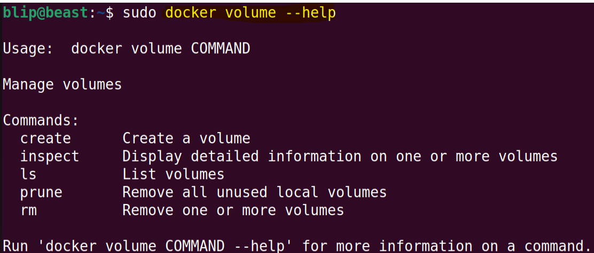

# Module 03: Docker Storage and Volumes
 * [Understanding the need for Volume service in Docker]()
 * [Create and Manage volumes]()
 * [Start a container with a volume]()
 * [Populate data in a volume using a container]()
 * [Use a read - only volume]()
 * [Understanding various Volume Plug-ins]()

 ## Understanding the need for Volume service in Docker
 * Docker volumes are file systems mounted on running containers to make sure that the data generated is preserved even after the docker container is stopped.
 * Its independent to the container and its lifecycle.
 * This helps to share required files from host system to container.
 * This storage implementation is also optimal for retrieving, storing, and transferring images across various environments.
 * Can be mapped to local storage.
 * Multiple container can use the same volume.

 ## Create and Manage volumes
 * We can use following commands to view volume information.
 * Try to explore more about volume using the following information:
```
sudo docker volume --help
sudo docker volume ls
sudo docker volume inspect
sudo docker volume rm <volName>
```


```
sudo docker volume ls
```


 #### Create a volume & Inspect.
 * To create a volume, use following commands:
```
sudo docker volume create <volumeName>
```
 * To view information about the volume just created, use:
```
sudo docker volume inspect <volumeName> 
```
 #### Mount a volume to the container.
 ```
 sudo docker run -itd --name <contName> --mount source=<volName> target=<insideTheContainer> <dockerImage:versionNumber>
 ```


 ## Start a container with a volume


 ## Populate data in a volume using a container


 ## Use a read - only volume


 ## Understanding various Volume Plug-ins

