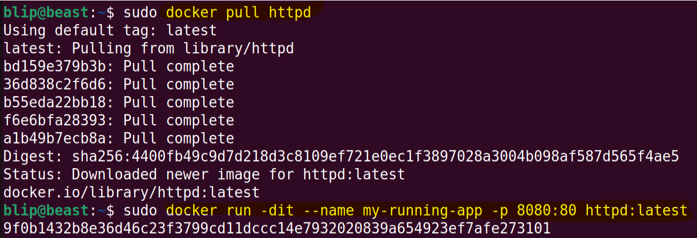
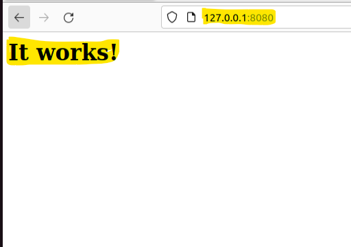
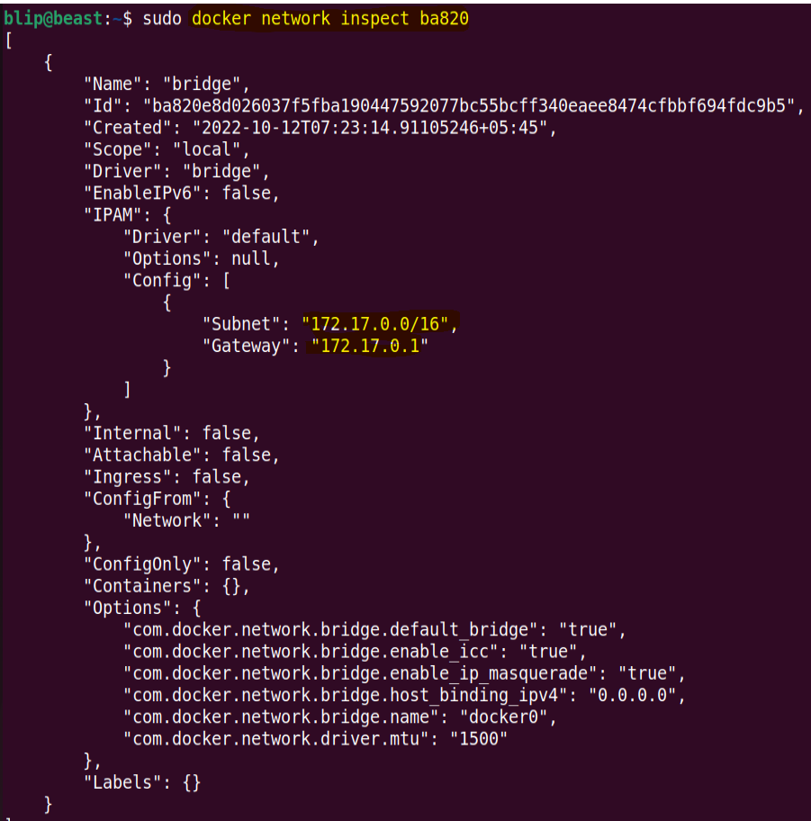
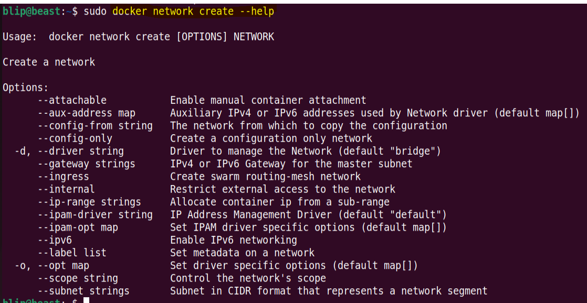

# Module 04: Docker Networking
* [Accessing containers](https://github.com/chaulags/learnDocker/tree/main/Module04#accessing-containers)
* [Exposing container ports](https://github.com/chaulags/learnDocker/tree/main/Module04#exposing-container-ports)
* [Docker Networking](https://github.com/chaulags/learnDocker/tree/main/Module04#docker-networking)
* [Linking containers](https://github.com/chaulags/learnDocker/tree/main/Module04#linking-containers)
* [Naming Our Containers](https://github.com/chaulags/learnDocker/tree/main/Module04#naming-our-containers)
* [Configure Docker to use external DNS](https://github.com/chaulags/learnDocker/tree/main/Module04#configure-docker-to-use-external-dns)
* [Docker Events](https://github.com/chaulags/learnDocker/tree/main/Module04#docker-events)

## Accessing containers
* There are different ways to connect to a docker container.
* Some of them are listed below.
```
sudo docker attach <containerID>
```
```
sudo docker exec -it <containerID> <command | Bash>
```
* However, these techinques are not limited to above mentioned techniques. 
* We can also connect to varios container through network. 
* So, first of all, we'll discuss about docker containers.

## Exposing container ports
* There are many cases where you need to expose various services.
* Port are required to make the service available for the consumers.
* Exposing ports will help to forward port from docker container to host network adapter.
* Following commands can be used to forward | Expose port
  - -p hostPort>:containerPort:: used to forward certain port from container to host
  - -P :: Use to forward all the port from container to host.
```
sudo docker run -it -p 80:80 <imageName>
```
```
sudo docker run -dit --name my-running-app -p 8080:80 httpd:latest
```




* Now the service is available to the host's port.
* Same technique can be used to forward other service such as SSH.

## Docker Networking
* One of the reasons Docker containers and services are so powerful is that you can connect them together, or connect them to non-Docker workloads.
* Docker networking allows you to attach a container to as many networks as you like. 
* Docker networking enables a user to link a Docker container to as many networks as he/she requires. 
* Docker Networks are used to provide complete isolation for Docker containers.


## Linking containers
* Docker supports networking for its containers via network drivers. 
* These drivers have several network drivers.

| Network Type | Description |
|---|---|
| Bridge | The default network driver.  If you don’t specify a driver, this is the type of network you are creating. Bridge networks are usually used when your applications run in standalone containers that need to communicate |
| Host | For standalone containers, remove network isolation between the container and the Docker host, and use the host’s networking directly. |
| None | For this container, disable all networking. Usually used in conjunction with a custom network driver. None is not available for swarm services. |
| Overlay | Overlay networks connect multiple Docker daemons together and enable swarm services to communicate with each other. You can also use overlay networks to facilitate communication between a swarm service and a standalone container, or between two standalone containers on different Docker daemons. This strategy removes the need to do OS-level routing between these containers. |
| MacVlan | Macvlan networks allow you to assign a MAC address to a container, making it appear as a physical device on your network. |
| IPVlan | IPvlan networks give users total control over both IPv4 and IPv6 addressing. |


#### Docker Network Connection
```
sudo docker network --help
```


```
sudo docker network ls
```


```
sudo docker network inspect <networkID>
```


#### Create Different Network
```
sudo docker network create <--help> 
```


```
sudo docker network create -d <driver> <networkName>
```


#### Change Network Adapters
```
sudo docker run -it --network <networkID> <imageName:version>
```
* To see what network(s) your container is on:
```
sudo docker inspect <container ID> -f "{{json .NetworkSettings.Networks }}"
```
* To disconnect your container from the first network
```
docker network disconnect <network Name> <container ID>
```
* Then to reconnect it to another network
```
sudo docker network connect <network Name> <container ID>
```
* To check if two containers (or more) are on a network together
```
sudo docker network inspect <network Name> -f "{{json .Containers }}"
```

## Naming Our Containers
```
sudo docker run -it --hostname web ubuntu:latest
```

## Configure Docker to use external DNS
* There are two ways to change the docker DNS setting.
* By adding another parameter while running a container
  - --dns DNSServerAddress
```
sudo docker run --dns <DNSServerAddress>
```
* Changing the default DNS address for the whole docker architecture.
```
sudo vim /etc/docker/daemon.json
```
* Add following:
```
{
  "dns": ["8.8.8.8"]
}
```
* Also, restart your docker daemon.
```
sudo systemctl restart docker
```
## Docker Events
* Use *docker events* to get real-time events from the server. 
* These events differ per Docker object type.
* Different event types have different scopes. 
  * Container
  * Volume
  * Network
  * Images
  * Daemon
  * Service
  * Secrets
  * Config
* Go to this [link](https://docs.docker.com/engine/reference/commandline/events/) for further information.
* You can use docker event by
```
sudo docker events
```
* Now all the activity will be reported through the output.
* You can also use linux redirections to store all these outputs.


[>> **Module 5**](https://github.com/chaulags/learnDocker/tree/main/Module05#module-05-docker-image-creation--compose)

[* * * Go To Top * * * ](https://github.com/chaulags/learnDocker/tree/main/Module04#module-04-docker-networking)
