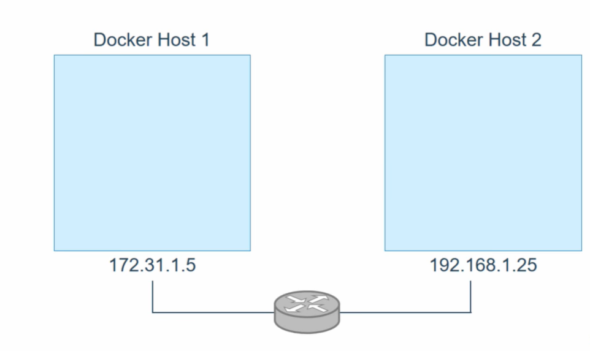
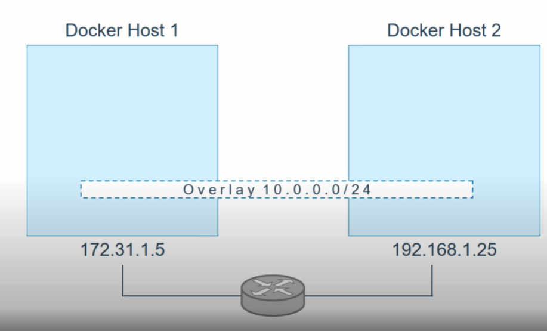
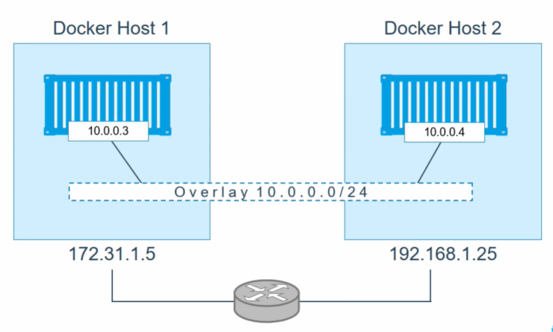

# Docker Swarm Continued (Deployment in Swarm)
* Multiple Deployment at the same time.
* In real world, there are multiple container with different services.
* Frontend, backend, database, token generator, API requests & other.
* This is where **Docker Stack Deploy** comes around.
* Docker Stack Deploy uses YAML file with all the configuration to deploy everything at once.


* Command used to deploy a Swarm Stack.
```
sudo dcoker stack deploy -c <yamlFile>.yml <stackName>
```
* Use *sudo docker ps* to view extra information.
* There are no replucas in any other worker nodes.
* As default replicas is 1.
* Using following to view the number of replicas.
```
sudo docker service ls
```


## Scaling
* Scaling is the process of adding or removing compute, storage, and network services to meet the demands a workload makes for resources in order to maintain availability and performance as utilization increases.

* Since there are only 1 replica for a service.
* We need to upscale it.
* Following commands can be used to upscale or down your service as desired.

```
sudo docker service scale <serviceID>=<number of **replicas**>
```
* View the replicas using.
```
sudo docker service ps <stackName>
```


## Rolling Updates
* Updating an image in the service, while the service is running.
* To reduce the downtime as less as possible.
* Service Level agreement binds technical team to take such procedures.
```
sudo docker service create --name <service Name> --replicas 3 <image:Version>
```
```
sudo docker service update --image <image:NewVersion> <service Name> 
```


## Draining Nodes
* In earlier steps of the tutorial, all the nodes have been running with ACTIVE availability. 
* The swarm manager can assign tasks to any ACTIVE node, so up to now all nodes have been available to receive tasks.
* Sometimes, such as planned maintenance times, you need to set a node to DRAIN availability.
* DRAIN availability prevents a node from receiving new tasks from the swarm manager.
* It also means the manager stops tasks running on the node and launches replica tasks on a node with ACTIVE availability.
```
sudo docker node update --availability drain <nodeID>
```
* All the loads handled by the drain node will be transfered to manager node.


## Connecting Service to a Network
* The overlay network driver creates a distributed network among multiple Docker daemon hosts.
* This network sits on top of (overlays) the host-specific networks, allowing containers connected to it (including swarm service containers) to communicate securely when encryption is enabled.
 







* Let's create a overlay network driver first.
```
sudo docker network create --driver overlay my-overlay
```
* Overlay driver is created. Now use the network in services.
```
sudo docker service create --replicas 3 --network my-overlay --name testing nginx:latest
```
