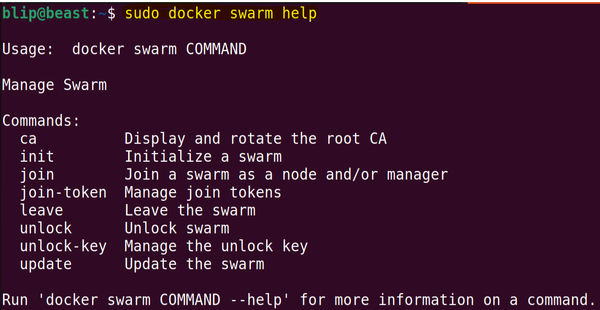
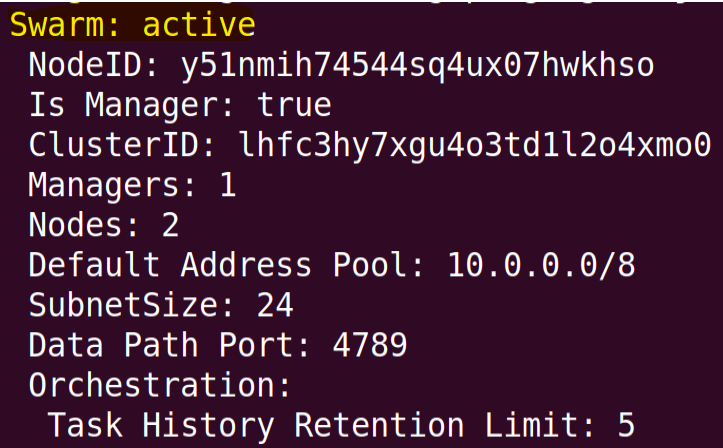
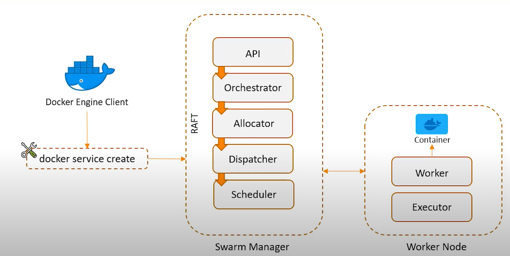

# Module 06: Container Orchestration using Docker Swarm
* Container Orchestration
* Docker Swarm Introduction
* Docker Swarm Architecture
* Docker Swarm and distribution strategies
<!-- * Installing Docker EE
* Installing Universal Control Plane ( UCP )
* Creating Users and Teams in UCP
* DTR Installation
* Create a DTR Repo
* Users and Teams in DTR
* Setting Permissions in DTR -->

## Container Orchestration
* Container Orchestration is the process of delpying and maintainig large number of containers & services for the application to run as intended.
* Automation of much of the operational effort required to run containerized workloads and services.
* Manage a container's lifecycle, including provisioning, deployment, scaling (up and down), networking, load balancing and more.
* Why Orchestration?
  * **Configuration and scheduling**
  * **Provisioning and deployment**
  * **Health monitoring**
  * **Resource allocation**
  * **Redundancy and availability**
  * **Updates and upgrades**
  * **Scaling or removing containers to balance workloads across the infrastructure**
  * **Moving containers between hosts**
  * **Load balancing and traffic routing**
  * **Securing container interactions**


* Container Orchestration Tools
  * Docker Swarm
  * Kubernetes
  * Mesos Marathon
  * Nomad
  * Amazon EKS
  * Azure Kubernetes Service


## Docker Swarm Introduction
* Docker Swarm is another popular open source container orchestration platform.
* The cluster management and orchestration features embedded in the Docker Engine are built using swarmkit.
* [Swarmkit](https://github.com/moby/swarmkit) is a separate project which implements Docker’s orchestration layer and is used directly within Docker.

## Docker Swarm Architecture


* **Services & Tasks**: 
  * A service is the definition of the tasks to execute on the manager or worker nodes.
  * It is the central structure of the swarm system and the primary root of user interaction with the swarm.
  * For global services, the swarm runs one task for the service on every available node in the cluster.
  * **Task** carries a Docker container and the commands to run inside the container. It is the atomic scheduling unit of swarm.
  * Manager nodes assign tasks to worker nodes according to the number of replicas set in the service scale.


* **Nodes**: A node is an instance of the Docker engine participating in the swarm.
  * **Manager Nodes**:
    * To maintain the cluster state.
    * Allocating IP addresses to tasks.
    * Accepting commands and creating service objects.
    * Assigning tasks to nodes.
    * Scheduling of Services.
    * Serving Swarm mode HTTP API endpoints.
    * Instructing a worker to run a task.
  * **Worker Nodes**
    * A manager node can exist without a worker node
    * Worker cannot exist without a manager.
    * Manager node assigns tasks to worker nodes.


## Docker Swarm Tutorials
This part mostly contains the working of docker swarm and its deployment features.

#### Initialize Docker Swarm
* Following command will help you understand sub-feature of the docker-swarm.
```
sudo docker swarm help
```


* To initialize the docker swarm:
```
sudo docker swarm init --advertise-addr <ipAddress>
```


* The above system is now the manager for the docker swarm cluster.
* We can also see the instruction to add more worker to this swarm cluster.


* To view more info about the docker-swarm:
```
sudo docker info ;; Go to Swarm Section
```


#### Manage Nodes in Docker Swarm Cluster
* To view all the nodes:
```
sudo docker node ls
```


* How worker node leave a docker swarm.
```
sudo docker swarm leave --force
```


* Remove the node from docker swarm cluster's manager.
```
sudo docker node rm <nodeID>
```


* If you want to view the token to add a worker to the cluster,
```
sudo docker swarm join-token worker
```
* If you want to add a node as **MANAGER**n the token to add a node to the cluster,
```
sudo docker swarm join-token manager
```


#### Docker Service Management
* Service is used to deploy an application image.
* Service will define how your task is going to be executed.
* For example service defines the replicas of the docker container to load balance the request for all the users & customers.
* Replicas are mostly deployed in different worker nodes so that even if any worker shuts down, another instance in another worker will respond to the request.
* Service might be slow, but availability of the service will not stop.
* **REDUNDANCY**



* To create a docker service:
```
sudo docker service create --replicas <number of instance> -p <port:Mapping> <image> 
```
* View services in all the nodes:
```
sudo docker service ls
```
```
sudo docker service ps <serviceID>
```
* Let's try and remove any replicas.
```
sudo docker rm -f <containerID>
```
* Wait for ittttt.
* Check using following commands.
```
sudo docker ps
```
* Delete a Service
```
sudo docker rm <serviceID>
```
* Extra information of a Service
```
sudo docker service inspect --pretty <serviceID or serviceName>
```

 