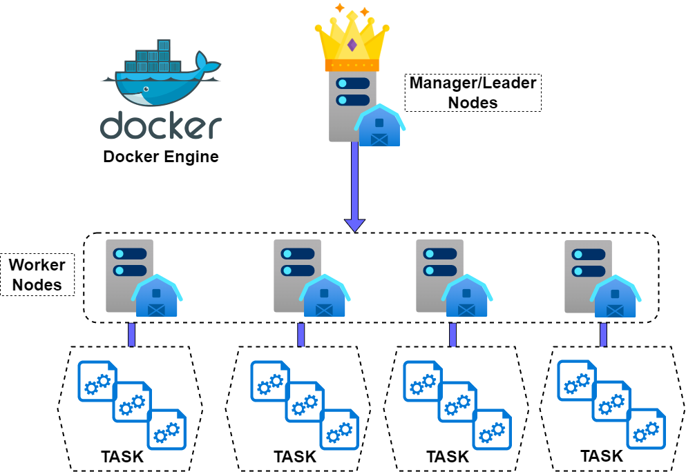

# Module 06: Container Orchestration using Docker Swarm
* Container Orchestration
* Docker Swarm Introduction
* Docker Swarm Architecture
* Docker Swarm and distribution strategies
<!-- * Installing Docker EE
* Installing Universal Control Plane ( UCP )
* Creating Users and Teams in UCP
* DTR Installation
* Create a DTR Repo
* Users and Teams in DTR
* Setting Permissions in DTR -->

## Container Orchestration
* Container Orchestration is the process of delpying and maintainig large number of containers & services for the application to run as intended.
* Automation of much of the operational effort required to run containerized workloads and services.
* Manage a container's lifecycle, including provisioning, deployment, scaling (up and down), networking, load balancing and more.
* Why Orchestration?
  * **Configuration and scheduling**
  * **Provisioning and deployment**
  * **Health monitoring**
  * **Resource allocation**
  * **Redundancy and availability**
  * **Updates and upgrades**
  * **Scaling or removing containers to balance workloads across the infrastructure**
  * **Moving containers between hosts**
  * **Load balancing and traffic routing**
  * **Securing container interactions**

* Container Orchestration Tools
  * Docker Swarm
  * Kubernetes
  * Mesos Marathon
  * Nomad
  * Amazon EKS
  * Azure Kubernetes Service

## Docker Swarm Introduction
* Docker Swarm is another popular open source container orchestration platform.
* The cluster management and orchestration features embedded in the Docker Engine are built using swarmkit.
* [Swarmkit](https://github.com/moby/swarmkit) is a separate project which implements Docker’s orchestration layer and is used directly within Docker.

## Docker Swarm Architecture

## Docker Swarm and distribution strategies

<!-- ## Installing Docker EE
## Installing Universal Control Plane ( UCP )
## Creating Users and Teams in UCP
## DTR Installation
## Create a DTR Repo
## Users and Teams in DTR
## Setting Permissions in DTR -->